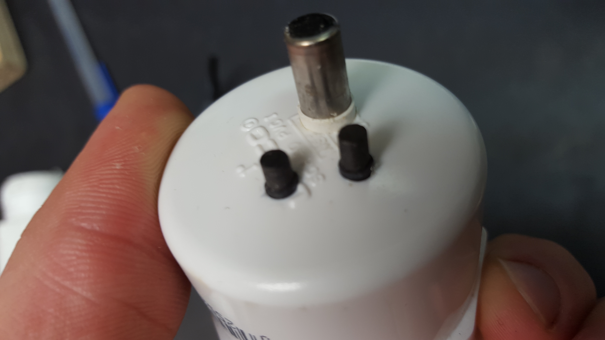
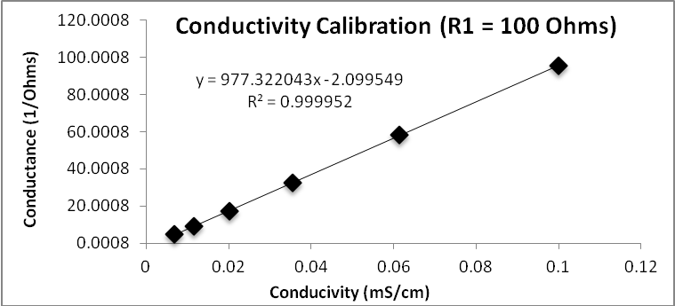
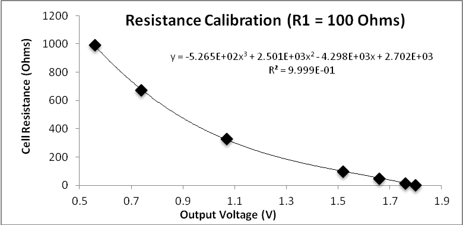
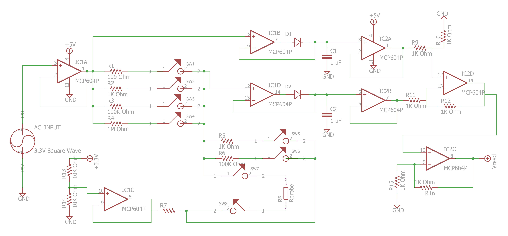
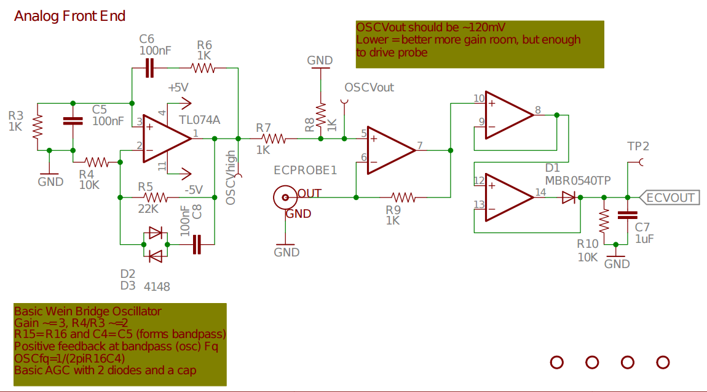
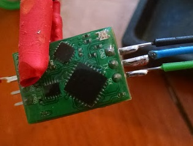
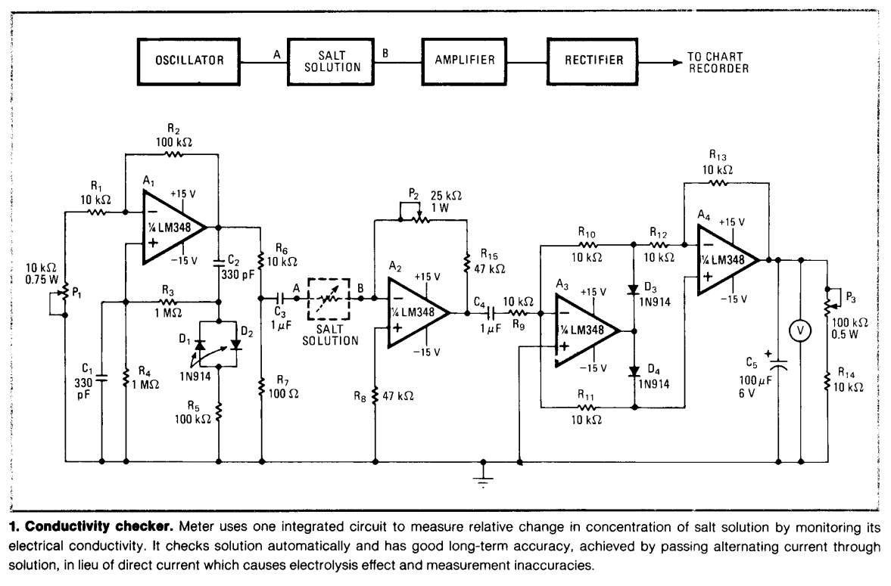

# DIY conductivity sensor designs

## Background

**Road Salt and the LovoTech network**. 

- Mark Green and Road Salt
- Lovotech network
- http://des.nh.gov/organization/divisions/water/wmb/was/salt-reduction-initiative/impacts.htm
- http://www.boston.com/news/local-news/2015/01/16/road-salt-where-does-it-come-from-where-does-it-go
- http://news.nationalgeographic.com/news/2014/02/140212-road-salt-shortages-melting-ice-snow-science/
- http://www.wired.com/2015/03/road-salt-polluting-rivers/
- http://science.howstuffworks.com/nature/climate-weather/atmospheric/road-salt.htm

**Salt water intrustion.**

https://en.wikipedia.org/wiki/Saltwater_intrusion
Groundwater extraction
Sea level rise

**Agriculture.**

http://www.fao.org/docrep/t0667e/t0667e05.htm

**Hydraulic Fracturing and pollution.**

Fracking http://www.fondriest.com/news/tracking-fracking.htm

## Characteristics of a good conductivity sensor

**Input signal**.

- AC measurement
- AC frequency
- Symmetric oscillation 
- Low voltage

**Probe design.**

- Non-corrosive / interactive
- Geometry
- Two probe vs. four probe
- Mitigating external fields
- Toroidal probe design

- https://publiclab.org/notes/bhickman/05-09-2016/conductivity-and-temperature-meter

- https://publiclab.org/notes/mathew/02-10-2016/riffle-conductivity-caps-and-other-housing-ideas

**Temperature compensation.**

## Calibration techniques

**Commercial standard solutions.** 

- http://www.davis.com/Product/Oakton_conductivity_solution_2764_S/YX-00653-20?referred_id=3388&gclid=Cj0KEQiArou2BRDcoN_c6NDI3oMBEiQANeix5up7px8eL9rByANeftTaCMyJusFlYSJtDb5ElptPo_AaAiaH8P8HAQ

**DIY options.**

- Saline solution
- Soda
- Salt and distilled water

## DIY sensor designs

**Ben Gamari.**

Ref: RIffle design, which includes conductivity sensor.

**Coqui.**  

Design.

Problems:

- https://publiclab.org/notes/donblair/01-07-2016/conductivity-sensing-open-questions

**Ben Hickman.**

- https://publiclab.org/notes/JSummers/11-21-2013/conductivity-meter
- https://publiclab.org/notes/bhickman/05-09-2016/conductivity-and-temperature-meter

**Sparky's Widgets.**

- http://hackaday.com/2014/11/10/accurately-measuring-electrical-conductivity/
- https://github.com/SparkysWidgets/MinieCHW

**openCTD.**

openCTD project
https://github.com/OceanographyforEveryone/OpenCTD
http://oceanographyforeveryone.com/

[Atlas Scientific conductivity circuit](http://www.atlas-scientific.com/product_pages/circuits/ezo_ec.html)

**Vintage.**

http://www.ullasmann.eu/Doc/Salt_Concentration_Meter.pdf

## Research directions

## Research Notes on Public Lab

All research notes tagged 'conductivity': 
- https://publiclab.org/tag/conductivity

'Coqui' approach:
- https://publiclab.org/wiki/coqui
- https://publiclab.org/wiki/555-conductivity-meter
- https://publiclab.org/notes/donblair/07-11-2014/simple-555-conductivity-meter
- https://publiclab.org/wiki/coqui-a-simple-water-conductivity-sensor
- https://publiclab.org/notes/donblair/01-07-2016/conductivity-sensing-open-questions
- https://publiclab.org/notes/rebeccah/08-29-2016/riffle-device-water-conductivity-sensor
- https://publiclab.org/notes/donblair/09-30-2014/making-a-diy-conductivity-probe-from-a-water-bottle-and-metal-screws

Jack Summers, Ben Hickman:
- https://publiclab.org/notes/bhickman/05-09-2016/conductivity-and-temperature-meter
- https://publiclab.org/notes/JSummers/11-21-2013/conductivity-meter

Patrick Hixenbaugh:
- https://publiclab.org/notes/pdhixenbaugh/08-20-2016/planning-for-a-new-riffle-conductivity-circuit

General:
- https://publiclab.org/notes/markwh/10-29-2014/calibrating-arduino-based-conductivity-meter
- https://publiclab.org/notes/donblair/06-18-2014/using-an-audio-jack-to-assess-conductivity

## References

- http://mediashift.org/2012/04/water-hackathon-aims-to-understand-brooklyns-water-pollution096/

## Guides to conductivity

- http://www2.latech.edu/~dehall/LWTL/ENGR121/notes/3_conductivity_sensor_intro.pdf
- https://www.snowpure.com/docs/FAQ_Conductivity_Thornton.pdf
- Fondriest : http://www.fondriest.com/environmental-measurements/parameters/water-quality/conductivity-salinity-tds/
- http://www.analytical-chemistry.uoc.gr/files/items/6/618/agwgimometria_2.pdf
- http://www.waterboards.ca.gov/water_issues/programs/swamp/docs/cwt/guidance/3130en.pdf
- https://www.pasco.com/support/technical-support/technote/techIDlookup.cfm?TechNoteID=514
- http://www1.udel.edu/pchem/C446/Experiments/exp4.pdf

## References for conductivity levels

- http://www.mbhes.com/conductivity_measurement.htm
- Relationship between conductivity and water quality: http://www.lenntech.com/applications/ultrapure/conductivity/water-conductivity.htm

